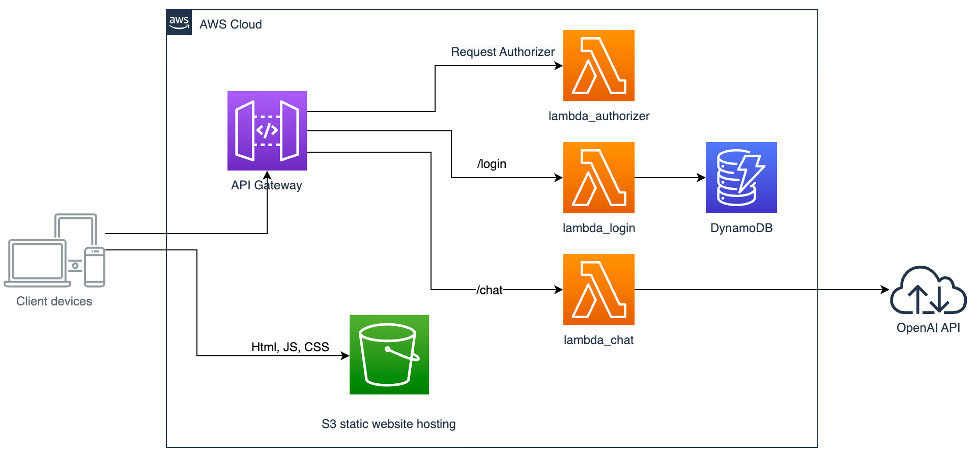
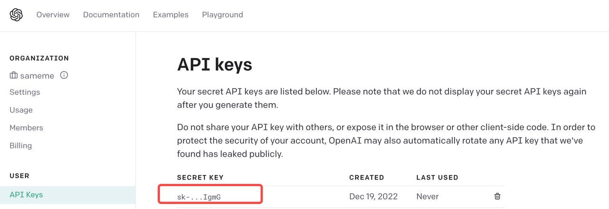
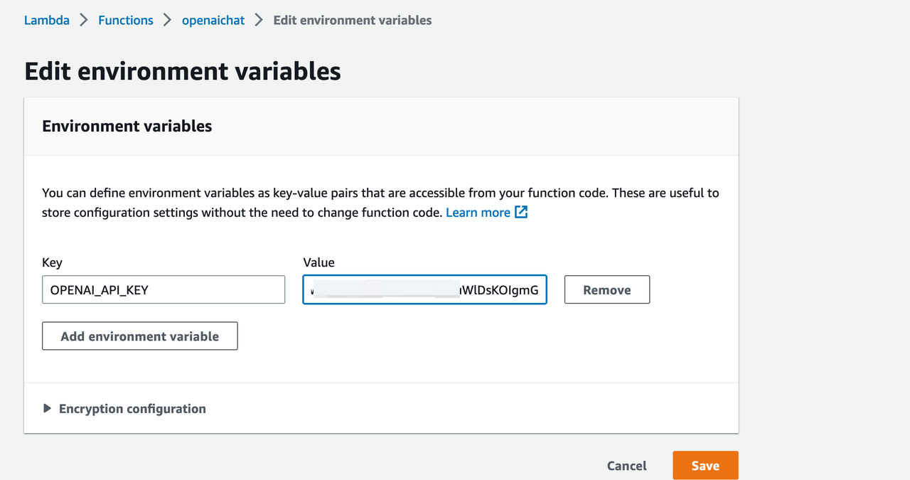
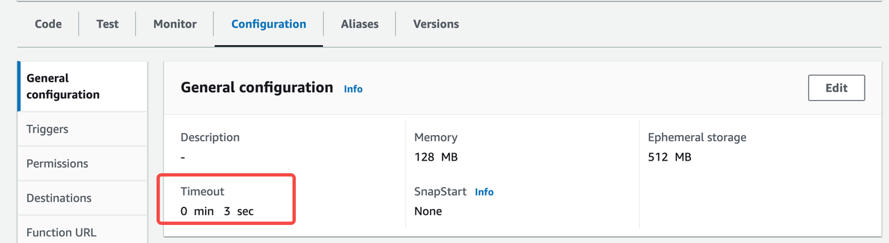
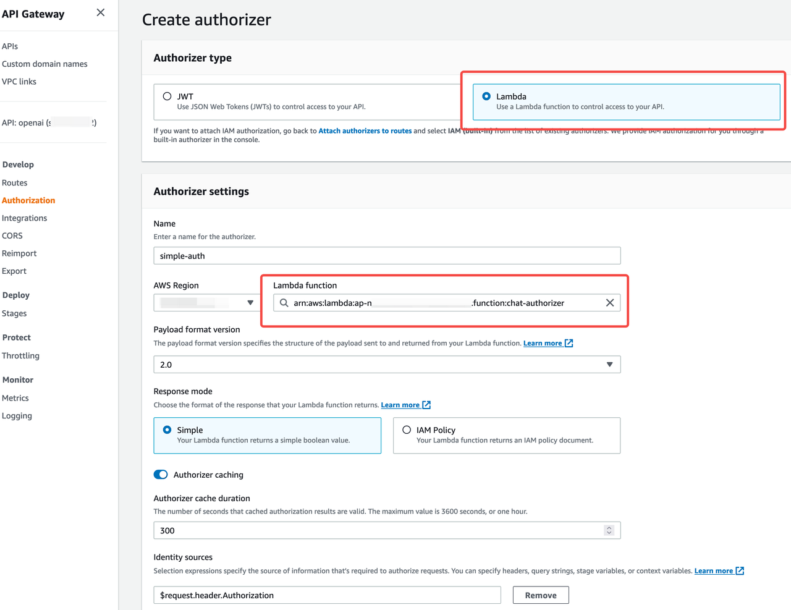
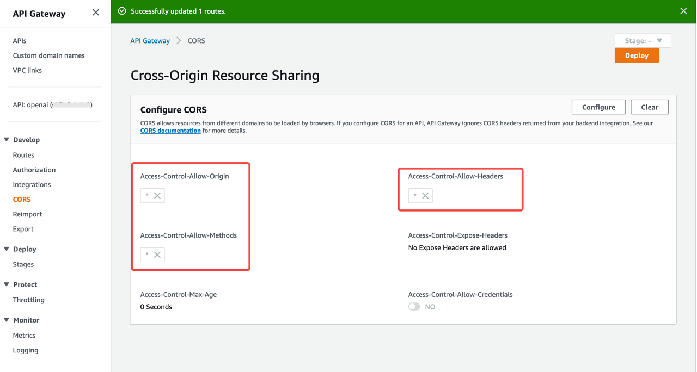
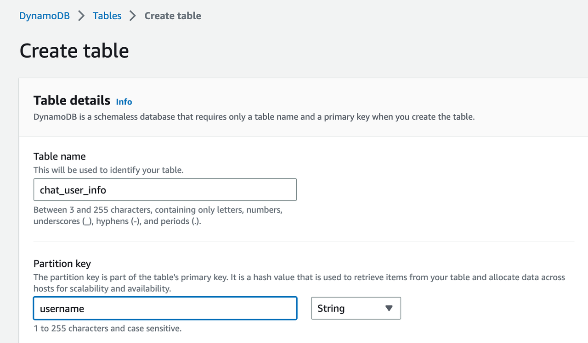
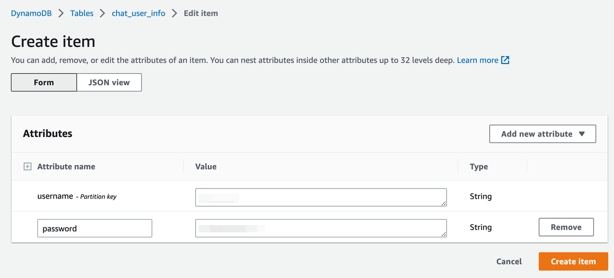
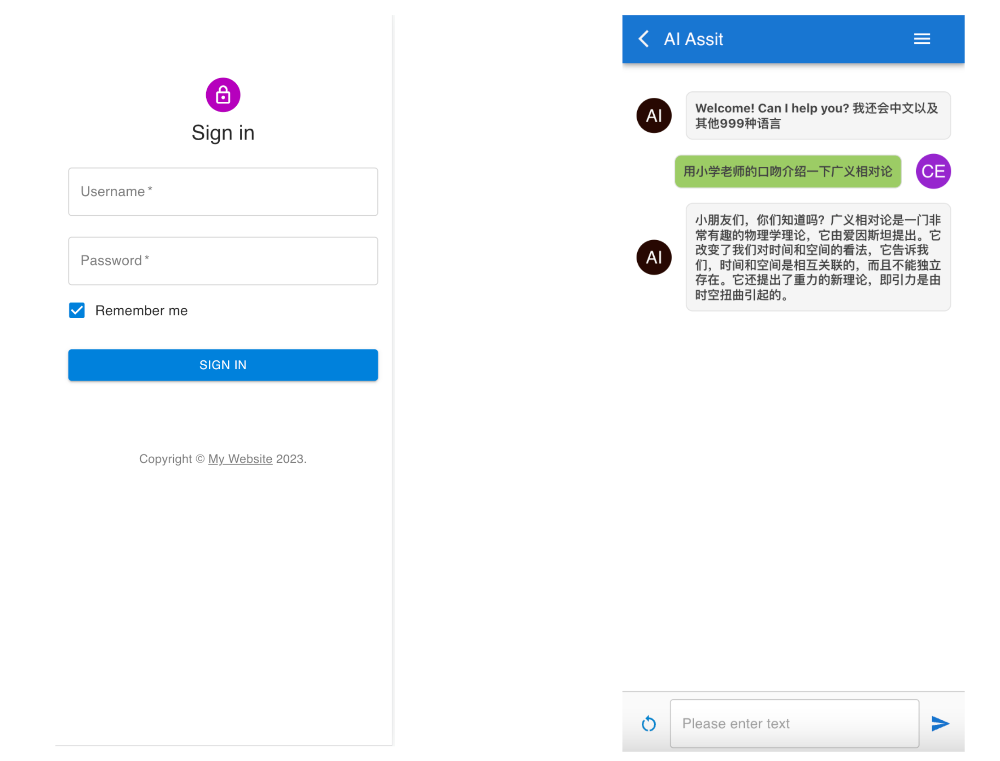
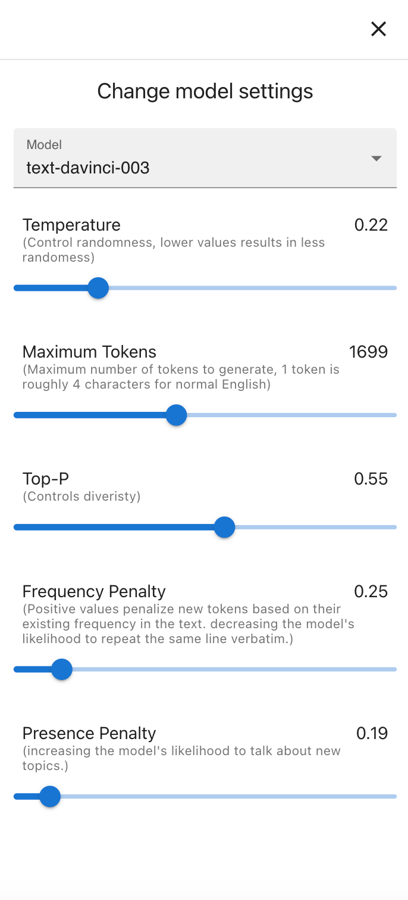

## Introduction
ChatGPT is a very popular artificial intelligence (AI) technology that enables natural language conversations between humans and machines. It is based on the open-source GPT-3 language model developed by OpenAI,  the model has been used in a variety of applications, from customer service chatbots to virtual assistants. It has also been used to generate human-like text in a wide range of formats, including conversation, story-telling, news articles, and more. ChatGPT has received positive feedback from the public and the research community for its ability to understand natural language, generate high-quality, coherent text, and meaningful responses. As the technology continues to evolve, it is expected that ChatGPT will become an increasingly important tool for businesses and individuals alike.  
In this sample , we will demonstrate using the API from OpenAI, to build a web application as your personal AI assistant on AWS using serveless architecture. And the services used in this project are all eligible for free tier.  The services to be used are :
- Amazon API Gateway
- Amazon Lambda
- Amazon S3
- Amazon DynamoDB
## Architecture
This application is totally serverless architecture:
- An Amazon S3 bucket is hosting the Html, JS, CSS files of the frontend client.
- An Amazon API Gateway is deployed to route the requests from client devices to backend services.
- The backend services are built on top Amazon Lambda, which includes a function to authorize the request, a function to process user sign in, a function to handle chat requests from the client and revoke OpenAI SDK function to get the response text from OpenAI server.
- An Amazon DynamoDB table also needs to be created to store the user name and credential to give some basic authorization of this application.

## Prerequisites
- You need to have an OpenAI account, and create an API key in the portal. 

- An AWS account. If your account is still eligible for free tier, then your application might cost zero under the free tier quota. 

## Setup local environment
- Install Nodejs (if you've already installed it, please skip this)
Install Nodejs in your local environment, to build static website files and some dependencies packages for Amazon Lambda. 
- Get source code and build the packages
The server folder contains the code for lambda functions. The client folder contains the code for the frontend website.
- Go to each lambda function folder under the server folder,  install the depencies and make .zip file archives for uploading to Amazon Lambda. For example, to make a lambda_login.zip:  
`>cd server/lambda_login`    
`>npm install   `   
`>zip -r lambda_login.zip`  
We will create 3 Amazon Lambda functions, that means we will make 3 .zip files (lambda_auth.zip/ lambda_login.zip/ lambda_chat.zip)in total.

## Create lambda functions
### Create a lambda function to handle chat.
1. In AWS console, create an lambda function from scratch named ***openai-chat***, choose Node.js 18.x for runtime.   
> If you are using a Mac with M1/M2 chips to build the NodeJS dependencies locally, please remember to choose "arm64" for architecture option. 
2. Upload the lambda_chat.zip created from last step to the lambda.
3. Configure your own OpenAI API key in environment variables as key named ***"OPENAI_API_KEY"***.  

4. OpenAI needs time to process the request, which is longer than 3 secs, so please change the runtime timeout to a larger value, e.g 1 min.  

### Create a lambda authorizer for API request authorization.
1. In AWS console, create an lambda function from scratch named ***chat-authorizer***, choose Node.js 18.x for runtime.  
2. Configure an arbitrary value as the your own token key. We use jsonwebtoken to authorize and validate the request, and this key will be used to sign the token. Store this token key in environment variables named "***TOKEN_KEY***".   
3. Upload the ***lambda_auth.zip*** file to the console, similar to the openai-chat function.  
### Create a lambda function to handle user login.
1. In AWS console, create an lambda function from scratch named ***openai-login***, choose Node.js 18.x for runtime.  
2. Add environment variables for ***TOKEN_KEY*** as same as the lambda authorizer function.  
3. This function will invoke DynamoDB service API to verify the user credentials, so we need to attach ***AmazonDynamoDBReadOnlyAccess*** policy or create an inline policy to the role of this function.
4. Upload the ***lambda_login.zip*** file to the console, similar to the ***openai-chat*** function.  

## Create API gateway
1. Create HTTP API gateway.  

2. Create two Routes using POST method: ***/chat , /login***.  
3. For ***/chat*** route, we need to attach lambda authorizer and integrate to the openchat lambda function.  
-- Create a lambda authorizer and attach it to ***/chat***. In lambda function field, select the ***"chat-authorizer"*** that you have created above.

-- Create and attach an integration. In lambda function field, select the ***"openai-chat"*** that you have created above.  
4 For ***/login*** route, we need to integrate to the lambda function created for login. In lambda function field, select the ***"openai-login"*** that you have created above.  
5 Set the CORS configuration as below:  

## Create DynamoDB table
We use Amazon DynamoDB to store username and password credentials. To simplify the demo, we will not implement the sign up function, and you can directly add the user and unencrypted password into the table. Or you can use the AWS CLI command in the code package. 
1. Sign in to the AWS Management Console and open the Amazon DynamoDB console, create a table name ***chat_user_info*** with the partition key ***username***.
. 
2. Add your username and password pairs to the table.  
. 

## Host website in S3
When you configure a bucket as a static website, you must enable static website hosting, configure an index document, and set permissions. You can read detail from **[AWS doc Reference](https://docs.aws.amazon.com/AmazonS3/latest/userguide/WebsiteHosting.html)**.  
1. Create an S3 bucket named ***bucket-name*** on Amazon S3 console.  
2. Enable static website hosting of this bucket. In Index document, enter the file name of the index document,> index.html.  
3. By default, the S3 bucket blocks public access. You need to change the setting by unchecking the option in the "Permssions" tab of the bucket detail page.  
4.  Add the below policy to the bucket policy to allow public access.  
    `{
        "Version": "2012-10-17",
        "Statement": [
            {
                "Sid": "PublicReadGetObject",
                "Effect": "Allow",
                "Principal": "\*",
                "Action": [
                   "s3:GetObject"
                ],
                "Resource": [
                "arn:aws:s3:::bucket-name/\*"
                ]
            }
        ]
    }`
5.  Then your Amazon S3 website follows one of these two formats:                                  
- http://bucket-name.s3-website-Region.amazonaws.com 
- http://bucket-name.s3-website.Region.amazonaws.com
### Build the static files for client
1. In your local environment, go to the client folder, change the first line of apigw.js to the actual API gateway endpoint which you created in the previous step.  
  > const API_endpoint = 'https://xxx.amazonaws.com/';
2. Then run these commands to install and build the packages for the front-end website.  
`>cd client`  
`>npm install`  
`>npm run build`  
3. After the "npm run build" completes, it will create a folder named "build" in the client folder. That folder has all the files to be deployed to the Amazon S3 website. You can upload this folder to the bucket through AWS S3 console or use AWS CLI as below:  
`>aws s3 sync ./build/ s3://bucket-name/
4. After all steps are done, now you can visit the s3 website endpiont in your PC/Mobile browser, and login the page with your username and password you stored in the DynamoDB table.
. 

5. You can change your model settings in the menu (**This is a new feature updated on Feb-11-2023**) 
. 

## Security

See [CONTRIBUTING](CONTRIBUTING.md#security-issue-notifications) for more information.

## License

This library is licensed under the MIT-0 License. See the LICENSE file.
